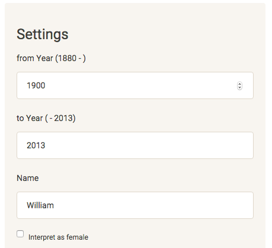

## Babynames

#### A New Shiny App

##### adrianvs  


---

### Overview


The Babynames Shiny App provides an interactive way to explore the babyname data set for 
the United States from 1880 to 2013 provided by the SSA.  
<br><br>
For any name you can visualize:  

1. its frequency in a time period you specify
2. its proportion of all babynames in that period
3. its total ranking in that period
4. all in a comparison with up to two additional names  

<br><br>
https://adrianvs.shinyapps.io/Babynames

--- 
### Frequency Analysis: Input

In the app you can enter a name and specify a time period.  
Two additional names can be entered for comparison.  
(picture)  



--- 

### Frequency Analysis: Output

A plot will be generated comparing the entered names.
<br><br>  

```{r, echo=FALSE, results = 'asis', comment = NA, message = F}
require(rCharts); require(babynames); require(dplyr); library(knitr)

df <- babynames
df$prop <- round(df$prop * 100,2)

plotdf <- df %>% filter(name == "William"  & sex == "M" |
                        name == "Jennifer" & sex == "F" |
                        name == "John"    & sex == "M",
                        year >= 1950 & year <= 2013)

p1 <- nPlot(n ~ year, 
        data = plotdf, 
        group = "name", 
        type = "multiBarChart")
                      
p1$yAxis(axisLabel = "Count", width = 40)
p1$xAxis(axisLabel = "Year")
p1$set(dom = 'bild')
p1$show(cdn = TRUE)
#p1 
```
Use your mouse to select/deselect names and change to a stacked bar plot; 
rCharts will automatically update the plot.


---  


### Most Popular Names

For any time period specified you can follow the most popular name by year:
<br><br>

```{r, echo=FALSE, results = 'asis', comment = NA, message = F}
df2 <- df %>% group_by(year, sex) %>% 
              mutate(position = min_rank(desc(n))) %>% 
              filter(position == 1, 
              sex == "F", 
              year >= 1990 & year <= 2013)

p3 <- nPlot(n ~ year, 
            data = df2, 
            group = "name", 
            type = "multiBarChart")
p3$yAxis(axisLabel = "Frequency", width = 40)
p3$xAxis(axisLabel = "Year")
p3$set(dom = 'bild3')
p3$show(cdn = TRUE)
#p3$print("chart1")
#p3
```


