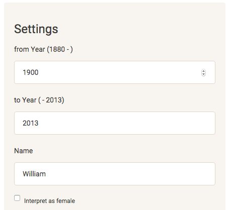

## Babynames

#### A New Shiny App

##### adrianvs  

---

### Overview

The Babynames Shiny App provides an interactive way to explore the babyname data set for 
the United States from 1880 to 2013 provided by the SSA.  
  

For any name you can visualize:  

1. its frequency in a time period you specify
2. its proportion of all babynames in that period
3. its total ranking in that period
4. all in a comparison with up to two additional names  

  
  
https://adrianvs.shinyapps.io/Babynames

--- 
### Frequency Analysis: Input

In the app you can enter a name and specify a time period.  
Two additional names can be entered for comparison.  
(picture)  

--- 

### Frequency Analysis: Output

A plot will be generated comparing the entered names.
    

<iframe src=' assets/fig/unnamed-chunk-1-1.html ' scrolling='no' frameBorder='0' seamless class='rChart nvd3 ' id=iframe- bild ></iframe> 
Use your mouse to select/deselect names and change to a stacked bar plot.   

---  

### Most Popular Names

For any time period specified you can follow the most popular name by year:
  

<iframe src=' assets/fig/unnamed-chunk-2-1.html ' scrolling='no' frameBorder='0' seamless class='rChart nvd3 ' id=iframe- bild3 ></iframe> 

